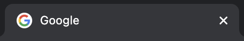

# 1. HTML이란? 🤔

## 1.1. HTML은 어떻게 생겼을까

 - 웹 페이지를 구성하고 있는 요소(element) 하나하나를 "**태그**"라는 표기법을 작성
 - 태그를 통해 어떤 요소인지 (제목, 본문, 이미지, 비디오 등) 명시
 - 태그의 이름은 HTML5 웹 표준에 맞게 작성

 > 1. 여는 태그(Opening tag) : <요소의 이름>
 > 2. 닫는 태그(Closing tag) : </요소의 이름>
 > 3. 내용(Content) : 요소의 내용
 > 4. 요소(Element) : 여는 태그, 닫는 태그, 내용을 통틀어 요소(element)라고 함

예시
```
<h1>This is Title!</h1>
<h2>fix you</h2>
<p>
  Lights will guide you home, And ignite your bones, And I will try to fix you.
</p>
```

 > 태그의 경우 대소문자를 구분하진 않지만, HTML5에서는 모두 **소문자**로 작성하는 것을 권장


## 1.2. 빈 요소(Empty elements)

 - 내용(content)이 없다면? ➡️ `이미지`, `수평선`, `줄바꿈` 등
 - 빈 요소(Empty element) : 내용이 없는 요소
 - 이 경우 닫는 태그를 추가로 명시하지 않아도 됨
 - Empty element, Self-Closing element, Void element, Single tag...

예시
```
<br>
<hr>

<meta charset="utf-8">
<input type="text" name="name">
```

## 1.3. 요소의 중첩 (Nesting)

 - 요소 안에 다른 요소가 들어가는 **포함관계**를 성립할 수 있다.
 - 이렇게 여러 요소가 중첩될 경우에는, 열린 순서의 **반대로** 닫혀야만 한다.
 - 이렇게 서로의 포함관계(부자관계)를 구분하기 위하여 **들여쓰기**를 사용한다.

예시
```
<html>
  <head>
    <title>요소의 중첩</title>
  </head>
  <body>
    <h1>요소 안에 <strong>다른 요소가</strong> 들어갈 수도 있습니다!</h1>
    <ul>
      <li>하나</li>
      <li>둘</li>
      <li>셋</li>
    </ul>
  </body>
</html>
```

## 1.4. 주석 (Comments)

 - 브라우저는 주석을 무시하여 사용자가 주석을 보이지 않게 한다.
 - 주석의 목적 : 코드에 메모를 추가하거나, 사용하지 않는 코드를 임시로 처리하기 위함

```
<p>I'm not inside a comment</p>
<!-- <p>I am!</p> -->
```

## 1.5. HTML 문서의 구조

```
<!DOCTYPE HTML>
<html>
  <head>
    <!-- HEAD 영역 -->
  </head>
  <body>
    <!-- BODY 영역 -->
  </body>
</html>
```

* ```<!DOCTYPE HTML>``` : 생략 가능
* ```html``` : 페이지 전체의 컨텐츠를 감싸는 루트(root) 요소
  - ```head``` : 웹브라우저 화면에 직접적으로 나타나진 않는 웹 페이지의 정보
    + ```meta tag``` : 문서의 일반적인 정보와 문자 인코딩을 명시
    + ```title``` : 
  - ```body``` : 웹브라우저 화면에 나타나는 모든 콘텐츠
- HTML이 표준화 되기 이전에는, 익스플로러의 액티브X처럼 독자적인 플러그인이 존재하기도 했음
- 웹 표준을 준수하여 작성한다면, 운영체제, 브라우저마다 의도된 대로 보여지는 웹 페이지를 만들 수 있음