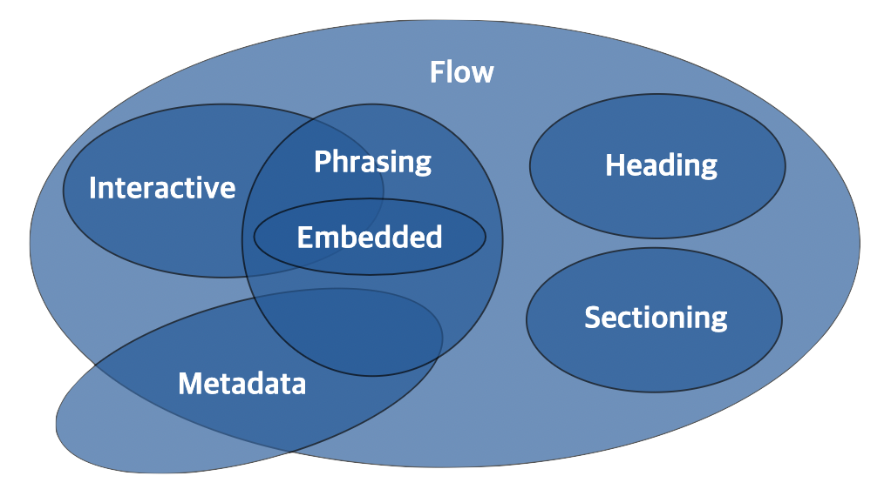

# 1. HTML이란? 🤔 (이어서)

## 1.6. HEAD 태그
**HTML \<head> 요소**는 기계(웹브라우저)가 식별할 수 있는 문서 정보(메타데이터)를 담음. 정보로는 문서가 사용할 제목, 스크립트, 스타일 시트 등이 있음.

 > 참고: ```<head>```의 주 목적은 기계 처리를 위한 정보이고, 사람이 읽을 수 있는 정보가 아님. 최상위 제목, 작성자 목록 등 사람에게 보여야 할 정보는 ```<header>``` 요소를 사용.<br>
 > HTML5 호환 브라우저는 \<head>가 없는 경우 자동으로 생성. 하지만 오래된 구형 브라우저에서는 X.

## 1.7. BODY 태그
**HTML \<body> 요소**는 HTML의 문서 내용을 나타냄. 한 문서에 하나의 <body> 요소만 존재할 수 있음.

## 1.8. 태그를 구분짓는 특성
### 1.8.1. 구획을 나누는 태그
 - 단독으로 사용했을 때에는 눈에 보이지 X
 - 여러가지 요소들을 묶어서 그룹화

### 1.8.2. 그 자체로 요소인 태그
 - 단독으로 사용했을 때에도 눈으로 확인할 수 O

## 1.9. 블록과 인라인
### 1.9.1. 블록(Block)
 - 블록 라벨 요소는 언제나 새로운 줄에서 시작하고, 좌우 양쪽으로 최대한 늘어나 가능한 모든 너비를 차지
 - 상자를 아래로 쌓는 것!

### 1.9.2. 인라인(Inline)
 - 인라인 요소는 **줄의 어느 곳에서나 시작**할 수 O
 - 바로 이전 요소가 끝나는 지점부터 시작하여, **요소의 내용(content)만큼만** 차지

 > 📦 포함 규칙
 > - 같은 형태의 다른 요소를 안에 포함할 수 O (블록 > 블록, 인라인 > 인라인)
 > - 대부분의 블록 요소는 다른 인라인 요소도 안에 포함할 수 O
 > - ⚠️ **인라인 요소는 블록 요소를 포함할 수 X**

## 1.10. 콘텐츠 카테고리
 - HTML5부터 비슷한 특징을 가진 요소끼리 묶어서 7가지 카테고리로 세분화
 - 하나의 HTML 요소가 여러 콘텐츠 카테고리 내의 포함관계에 들어갈 수도 O


<https://www.w3.org/TR/2011/WD-html5-20110525/content-models.html>

|종류|내용|
|---|---|
|메타데이터 콘텐츠 (Metadata Content)|문서의 메타데이터(정보), 다른 문서를 가리키는 링크 등을 나타내는 요소|
|플로우 콘텐츠 (Flow Content)|웹 페이지상에 메타데이터를 제외하고 거의 모든 요소. 보통 텍스트나 임베디드 콘텐츠를 포함|
|섹션 콘텐츠 (Section Content)|웹 문서의 구획(Section)을 나눌 때 사용|
|헤딩 콘텐츠 (Heading Content)|섹션의 제목(Heading)과 관련된 요소|
|프레이징 콘텐츠 (Phrasing Content)|문단에서 텍스트를 마크업 할 때 사용|
|임베디드 콘텐츠 (Embedded Content)|이미지나 비디오 등 외부 소스를 가져오거나 삽입할 때 사용되는 요소|
|인터렉티브 콘텐츠 (Interactive Content)|사용자와의 상호작용을 위한 콘텐츠 요소|

# 2. 메타데이터 요소

## 2.1. 메타데이터의 역할
 * metadata : 데이터를 설명하는 데이터, 데이터를 위한 데이터

## 2.2. title
**HTML \<title> 요소**는 브라우저의 제목 표시줄이나 페이지 탭에 보이는 문서 제목을 정의. 텍스트만 포함할 수 있음. 태그를 포함하더라도 무시.

## 2.3. meta - 문서 정보
**HTML \<meta> 요소**는 \<base>, \<link>, \<script>, \<style>, \<title> 과 같은 다른 메타관련 요소로 나타낼 수 없는 메타데이터를 나타냄.
 - `name`과 `content` 특성을 함께 사용하면 문서의 메타데이터를 이름-값 쌍으로 제공할 수 O (`name` -> 이름, `content` -> 값)

## 2.4. meta - 문자 인코딩, 뷰 포트

## 2.5. MIME 타입

## 2.6. style

## 2.7. script

