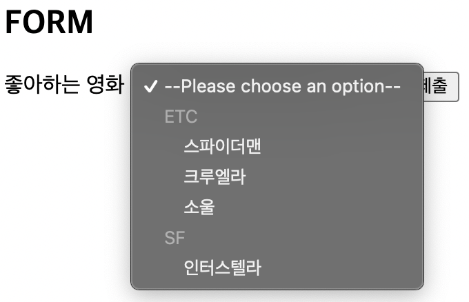
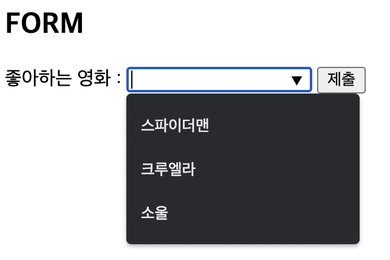

# 1. 폼 관련 요소
## 1.1. form
`<form>`
 * 정보를 제출하기 위한 대화형 컨트롤을 포함하는 문서 구획
 * `action`
   - 양식 데이터를 처리할 프로그램의 URI
   - 데이터를 보낼 목적지의 주소를 입력받음
 * `method`
   - 양식을 제출할 때 사용할 HTTP 메서드
     + `post` : POST 메서드. 양식 데이터를 요청 본문으로 전송
     + `get` : GET 메서드. 양식 데이터를 action **URL**과 **?** 구분자 뒤에 이어 붙여서 전송 ➡️ 주소창에 드러나므로 **보안에 약함**
     + dialog : 양식이 \<dialog> 안에 위치한 경우, 제출과 함께 대화 상자를 닫음

## 1.2. label과 input
`<label>`
 * 사용자 인터페이스 항목의 설명을 나타냄
 * 가능하면 접근성 측면에서 `<input>`을 설명하는 문구를 정확하게 텍스트로 적어주는 것이 좋음
 * `for`
   - 레이블 가능한 요소일 때, **for 속성값과 일치하는 <i>id</i>를 가진 문서의 첫 번째 요소**는 그 label 요소의 라벨 제어라고 함
   - `<label>`의 형제가 아닌 **자식**으로 `<input>`를 갖는다면 for과 id 속성을 각각 입력할 필요가 없음


## 1.3. fieldset, legend
`<fieldset>`
 * 여러 컨트롤과 레이블(\<label>)을 묶을 때 사용
 * display 속성 - **block**
 * `disabled`
   - 모든 자식 컨트롤을 비활성화
  
`<legend>`
 - 부모인 \<fieldset>의 콘텐츠 설명을 나타냄
 - <b>\<fieldset></b>의 **첫 번째 자식**이어야 함

예시)
```html
<form action="" method="GET">
  <fieldset disabled>
    <legend>범례 1</legend>
    <div>
      <label for="foodname">음식 이름 : </label>
      <input type="text" name="food" id="foodname">
    </div>
    <div>
      <label for="color">색깔 : </label>
      <input type="text" name="color" id="color">
    </div>
  </fieldset>
  <button type="submit">제출</button>
</form>
```

## 1.4. input
`<input>` (입력 요소)
 - 사용자의 데이터를 받을 수 있는 대화형 컨트롤을 생성
 - **빈 요소**이기 때문에 닫는 태그가 없음

`type`
[적용 코드](../practice/ex_2.html)

`name`
 - \<input> form의 이름
 - 이름/값 짝(name/value pair)의 일부로서 form과 함께 전송됨

`placeholder`
 - \<input> form이 비어있을 때 form에 나타나는 내용

`autocomplete`
 - form 자동완성 기능을 암시
 - **on/off**로 사용을 지정함

`required`
 - Boolean 속성
 - 필수 form을 지정할 때 사용

`disabled`
 - 입력도 불가능하고 form 데이터도 전송되지 않음
  
`readonly`
 - 단순히 수정만 불가능하고 form 데이터는 전송됨
 - `value`로 기본값 설정 가능

`min`, `max`, `step`
 - \<input type="`number`"/>와 \<input type="`range`"/>에서 설정할 수 있음

## 1.5. button
`<button>`
 * 클릭 가능한 버튼을 나타냄
 * **빈 요소 X**, 닫는 태그 O
 * 아이콘만으로 기능을 표현하는 버튼은 접근성이 떨어짐
 * `type`
   - **submit** : 버튼이 서버로 form 데이터를 제출함
   - **reset**
   - **button** : 기본 행동이 없으며 클릭했을 때 아무것도 하지 않음
  
#### 💡 `<input>`와 다른 점
 > `<input>` : 빈 요소, `<button>` : 자식을 가질 수 있는 요소<br>
 > `<button>`는 자식을 가질 수 있기 때문에 단순히 문자열로 버튼을 꾸밀 수 있는 것이 아니라,<br>
 > 내부에 이미지나 svg 등을 추가해서 넣을 수 있음. ➡️ 스타일링을 용이하게 할 수 있음.

예시)
```html
<form action="" method="GET">
  <div>
    <input type="reset" />
    <input type="submit" />
    <input type="button" value="빈 버튼" />
  </div>
  <div>
    <button type="reset">
      <em>초기화</em>
    </button>
    <button type="submit">제출</button>
    <button type="button">일반 버튼</button>
  </div>
</form>
```

## 1.6. select, option, optgroup
`<select>`
 - 옵션 메뉴를 제공하는 컨트롤을 나타냄
 - 사용자가 **수정 불가능**
 - **자식** 요소 : `<option>`, `<optgroup>`

예시)
```html
<form action="" method="GET">
  <label for="movie">좋아하는 영화 : </label>
  <select id="movie" name="movie" required>
    <!-- 후보군 -->
    <option value="">--Please choose an option--</option>
    <optgroup label="ETC">
      <option value="Spider-Man">스파이더맨</option>
      <option value="Cruella">크루엘라</option>
      <option value="Soul">소울</option>
    </optgroup>
    <optgroup label="SF">
      <option value="Interstellar">인터스텔라</option>
    </optgroup>
  </select>
  <input type="submit" />
</form>
```




## 1.7. input - list 속성과 datalist
`list`
 - \<datalist>의 **id**를 가리킴
 
`<datalist>`
 - 다른 컨트롤에서 고를 수 있는 가능한 선택지를 추천하는 \<option> 여럿을 담음
 - 사용자가 **수정 가능**

예시)
```html
<form action="" method="GET">
  <label for="movie">좋아하는 영화 : </label>
  <input type="text" id="movie" name="movie" list="movie-list"/>
  <datalist id="movie-list">
    <!-- 후보군 -->
    <option>스파이더맨</option>
    <option>크루엘라</option>
    <option>소울</option>
  </datalist>
  <input type="submit" />
</form>
```



## 1.8. textarea
 - \<input type="text">와 비슷함
 - **멀티라인** 일반 텍스트 편집 컨트롤
 - **빈 요소 X**, 닫는 태그 O
 - `rows="숫자"`, `cols="숫자"`, `disabled`, `readonly`, `placeholder`, `required`, ...


# 2. 전역 속성
## 2.1. class, id
## 2.2. style
## 2.3. title
## 2.4. lang
## 2.5. data
## 2.6. draggable
## 2.7. hidden


# 테스트 복습
HTML 스타일 가이드
- 언제나 Document type 선언 (V)
- element 내용은 상황에 맞게 대소문자 사용 (X)
- 꼭 닫지 않아도 되는 사항이어도, html elements는 항상 닫도록 함
- \<html>과 \<body>는 생략하지 않음

h1 : HTML 문서에서 가장 중요한 제목(Heading)을 정의하는 태그

HTML 유효성 검사를 할 때, Error, Warning 없이 통과할 수 있는 코드
```html
1. <section><p>Hello World</p></section>
2. 
3. <html>...</html> (V)
4. <article><h3>Hello World</h3><article> (O)
```

\<p> title 속성

height 및 width가 가질 수 없는 속성
1. auto - 자동
2. % - 백분율
3. length - px, cm 등으로 정의 가능
4. full


테이블 태그에 대해 잘못 설명
1. th(table header)는 테이블의 첫 row에만 작성 가능
2. tr(table row) 안의 td(table data)는 각 행마다 크기가 다를 수 있음
3. colspan 속성을 통해 여러 col을 합쳐 표현할 수 있음
4. td의 기본 속성은 왼쪽 정렬

text를 formatting하기 위한 것으로 잘못 설명
1. \<del> - 삭제된 텍스트 표시
2. \<i> - 이탤릭체
3. \<strong>과 \<b> - 모두 텍스트를 진하게 표시하는 완전히 동일한 기능을 함 (X)
4. \<small> - 글자 크기를 줄임

HTML5에 새롭게 등장한 태그가 아닌 것
- \<mark>
- \<article>
- \<table> (V)
- \<hgroup>

\ 태그의 alt 속성 역할이 아닌 것
- 이미지 경로를 받지 못하는 상황에서 이미지 대신 글자를 보여주기 위해 사용됨 (V)
- 검색 엔진에 그림에 대한 정보를 전달하기 위해 사용됨
- 스크린 리더에 이미지 정보를 전달할 때 사용됨
- 마우스 커서를 올릴 때 이미지 정보를 사용자에게 전달하기 위해 사용됨 (X)

meter 태그를 사용할 때 최솟값과 최댓값을 나타내는 속성
- min, max

```html
<body>
  <section>
    <h1>이 사이트의 제목</h1>
    <section>
      <h2>개요 1</h2>
    </section>
    <section>
      <h2>개요 2</h2>
      <article>
        <h3>서브개요 1</h3>
      </article>
    </section>
  </section>
</body>
```

위 코드에서 어떤 태그의 오류로 인해 SEO를 지키기 위한 Heading-level outline이 Structural outline과 같지 않는다. 이유는?
1. section 안에 section 태그가 들어있다.
2. h2태그가 section 태그 안에 들어있다.
3. 최상위 section 태그가 main 태그로 교체되어야 한다. (O)
4. h2 태그와 h3 태그 모두 최상위 section 태그와 동일한 구조 레벨이어야 한다. (V)
5. h1이 다른 section 태그의 자식태그여야 한다.


텍스트를 대문자로 표시하면서 소문자형으로 나타내는 속성
- font-variant : small-caps

form 태그 속성
```html
<form action="/login.php" method="get">
  <label for="name">성명 : </label>
  <input type="text" id="name" name="name">
</form>
```

HTML에서 2칸 이상의 공백을 표시하기 위해 `&nbsp;` 사용


\<meta> property
1. og:title
2. og:description

```html
<meta property="og:title" content="luvbud github 입니다.">
<meta property="og:description" content="안녕하세요. 매일 TIL 작성 중 입니다...">
```