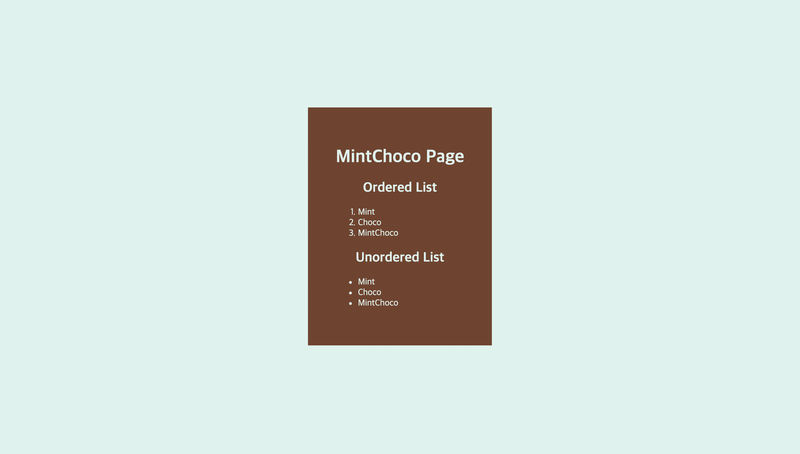

# 1. 목록과 표 ✅
## 1.1. 목록 - ol, ul, li

> \<ol>, \<ul>는 \<li>을 자식으로 가짐

`<ol>`
 - **정렬된 목록**(숫자 목록)
 - 전역 속성을 포함함
  
| 속성       | 내용                                                                                                                                                                    | 예                       |
| ---------- | ----------------------------------------------------------------------------------------------------------------------------------------------------------------------- | ------------------------ |
| `reversed` | 목록을 역순으로 배열                                                                                                                                                    | \<ol reversed>...\</ol>  |
| `start`    | 항목을 셀 때 시작할 수                                                                                                                                                  | \<ol start="3">...\</ol> |
| `type`     | 항목을 셀 때 사용할 카운터 유형<br> ・ 'a' : 소문자 알파벳<br>・ 'A' : 대문자 알파벳<br>・ 'i' : 소문자 로마 숫자<br>・ 'I' : 대문자 로마 숫자<br>・ '1' : 숫자(기본값) | \<ol type="A">...\</ol>  |

#### 같은 표현
> \<ol start="3">\<li>내용\</li>\</ol><br>\<ol>\<li value="3">...\</li>\</ol><br>
- **\<li>에 value 속성을 쓰는 것 보다 \<ol>에 start 속성을 쓰는 것이 가독성이 더 좋음!**

`<ul>`
 - **정렬되지 않은 목록**(불릿)
 - 전역 속성만 사용 가능


예시)
```html
<h2>
  <span>Ordered List</span>
</h2>
<ol> <!-- 정렬 목록 -->
  <li>Mint</li>
  <li>Choco</li>
  <li>MintChoco</li>
</ol>

<h2>
  <span>Unordered List</span>
</h2>
<ul> <!-- 비정렬 목록 -->
  <li>MintChoco</li>
    <ul>
      <li>Mint</li>
      <li>Choco</li>
    </ul>
</ul>
```
[적용 코드](../practice/html/ex_1.html)
예시)



## 1.2. 정의 목록 - dl, dt, dd
> \<dl>는 \<dt>, \<dd>을 자식으로 가짐

`<dl>`
 * \<dt>로 표기한 용어 + \<dd>로 표기한 설명
 * 용어사전 구현이나 메타데이터(키-값 쌍 목록)를 표시할 때 사용
 * 이름-값 그룹을 \<div>로 감쌀 수 있음
   - 마이크로데이터를 사용할 때, 그룹에 전역 속성을 적용할 때, 스타일을 적용할 때 유용
 * \<dt>와 \<dd>의 형제로 \<div>를 사용하면 안됨

예시)
```html
<dl>
  <dt>Firefox</dt>
  <dd>
    Mozilla 재단과
    모질라 코퍼레이션이 개발한
    무료 오픈소스 크로스 플랫폼
    그래픽 웹 브라우저.
  </dd>
  <dd>
    붉은 판다, 레서 판다, 랫서 판다,
    혹은 "Firefox"는 초식성 포유류이다.
  </dd>
</dl>
```

Tip) 키-값 구분자를 CSS로 지정하면 편리함
```css
dt:after {
  content: ": ";
}
```


## 1.3. 표 - table, tr, th, td

`<table>`
 - 행과 열로 이루어진 표
 - \<table>를 가지고 layout을 만드는 것은 지양해야 함 

`<tr>`
 - table row (행)

`<th>`
 * table head (행이나 열을 대표하는 명칭을 표현)
 * `scope` : \<th>가 어떤 것의 대표인지를 명시하려고 작성하는 것, 접근성을 높이려면 작성하는 것이 좋음
   - 예) \<th scope="col">나라이름\</th> ➡️ 나라이름은 열을 대표함

`<td>`
 - table data
 - `colspan` : 차지하고 있는 영역을 넓힘

## 1.4. thead, tbody, tfoot

 > \<thead>, \<tbody>, \<tfoot>는 꼭 형제로!<br>스타일링 측면에서 아주 용이함.


## 1.5. caption
`caption`
 - **표**의 설명, 제목을 나타냄
 - \<table> 요소의 **첫 번째 자식**이어야 함
 - 위쪽이 아닌 다른 위치로 바꾸고 싶다면 CSS로 수정
 - \<table> 요소가 만약 \<figure> 요소의 유일한 자식인 경우, \<figcaption>을 대신 사용


# 2. 임베디드 요소 🌠
외부의 소스를 불러와서 웹 페이지 내에 삽입하는 요소
## 2.1. img - src, alt
 ``
 * 문서에 이미지를 넣음
 * **빈 요소**이기 때문에 닫는 태그가 없음
 * `src`
   - **필수**, 이미지의 경로 지정
   - 절대 경로
   - 상대 경로
 * `alt` (alternative text)
   - 이미지의 텍스트 설명
   - 스크린 리더가 alt의 값을 읽어 사용자에게 이미지를 설명, **접근성** 차원에서 매우 유용함
   - 네트워크 오류, 콘텐츠 차단, 죽은 링크 등 이미지를 표시할 수 없는 경우에 이 속성의 값을 대신 보여줌

## 2.2. 웹에서 사용하는 이미지 유형
| Abbreviation | MIME type       | File extension(s)                          | Summary                                                                         |
| ------------ | --------------- | ------------------------------------------ | ------------------------------------------------------------------------------- |
| **JPEG**     | `image/jpeg`    | `.jpg`, `.jpeg`, `.jfif`, `.pjpeg`, `.pjp` | 정지 이미지의 손실 압축에 적합 (현재 가장 많이 사용됨)                          |
| **PNG**      | `image/png`     | `.png`                                     | 원본 이미지를 보다 정확하게 보여주거나 **투명도가 필요한 경우** JPEG보다 선호됨 |
| **GIF**      | `image/gif`     | `.gif`                                     | 여러장의 이미지로 이루어진 애니메이션 표현 가능                                 |
| **WEBP**     | `image/webp`    | `.webp`                                    | 구글이 만든 이미지 포맷, 품질, 압축률 등이 훨씬 우수, 지원 브라우저가 제한적    |
| **SVG**      | `image/svg+xml` | `.svg`                                     | 다양한 크기로 정확하게 그려야 하는 아이콘, 다이어그램 등에 사용됨               |

 - **래스터** 이미지 : JPEG, PNG, GIF, WEBP (일반적인 사진들)
 - **벡터** 이미지 : SVG (아이콘, UI요소들, 그래프 등)

## 2.3. 반응형 이미지 - srcset, sizes
`srcset`
 - viewport에 따라 맞는 이미지를 출력
 - 웹 브라우저가 사용할 수 있는 이미지 소스의 후보
 - 쉼표로 구분하는 한 개 이상의 문자열 목록
 - 너비 서술자(w), 픽셀 밀도 서술자(x)

`sizes`
 - 미디어의 조건(마지막 항목에서는 생략해야 함), 소스 크기 값으로 구성됨

예시)
```html

```

## 2.4. video
`<video>`
 * 비디오 플레이백을 지원하는 미디어 플레이어를 문서에 삽입
 * **빈 요소 X**, 닫는 태그 O
 * **src** 또는 <b>\<source></b>를 사용해 한 개 이상의 비디오 소스를 지정할 수 있음
 * 다수를 지정한 경우 가장 적절한 소스를 브라우저가 고름
 * `src`
   - 임베디드할 동영상의 주소(url)
   - **선택 사항**으로, 비디오 블록 내의 <b>\<source></b>를 사용하여 삽입할 동영상을 명시할 수 있음
 * `controls`
   - Boolean 속성. 소리 조절, 동영상 탐색, 일시 정지, 재시작을 할 수 있는 컨트롤러 제공
 * `autoplay`
   - Boolean 속성. 데이터 로딩이 완료되지 않더라도 재생 가능한 시점에 자동으로 재생이 시작됨
   - 오디오나 비디오를 자동 재생하는 사이트는 사용자 경험에 악영향을 끼칠 수 있으므로 사운드가 있으면 자동 재생이 되지 않음
 * `muted`
   - Boolean 속성. 비디오에 포함되어 있는 오디오의 기본 설정을 나타냄
   - 설정하면 오디오가 나오지 않음
 * `loop`
   - Boolean 속성. 자동 반복 재생
 * `poster`
   - 사용자가 동영상을 재생하거나 탐색하기 전까지는 출력되는 포스터 프레임 주소
   - 속성이 명시되지 않으면 첫 번째 프레임을 포스터 프레임으로 출력

예시)
```html
<video controls>
  <source src="video/sample_mp4_file.mp4">
    Sorry, your browser doesn't support embedded videos.
</video>
```

## 2.5. audio
`<audio>`
 - 문서에 소리 콘텐츠를 포함할 때 사용
 - **src** 또는 <b>\<source></b>를 사용해 한 개 이상의 오디오 소스를 지정할 수 있음
 - 다수를 지정한 경우 가장 적절한 소스를 브라우저가 고름

## 2.6. canvas, iframe
`<canvas>` (그래픽 프레임 요소)
 - 그래픽과 애니메이션을 그릴 수 있음
 - JavaScript를 사용해서 내부에 그림을 그림

예시)
```html
<canvas id="canvas" width="300" height="300">
  캔버스의 내용을 설명하는 대체 텍스트
</canvas>
```

`<iframe>` (인라인 프레임 요소)
 - 중첩 브라우징 맥락을 나타내는 요소
 - 현재 문서 안에 **다른 HTML 페이지를 삽입**함