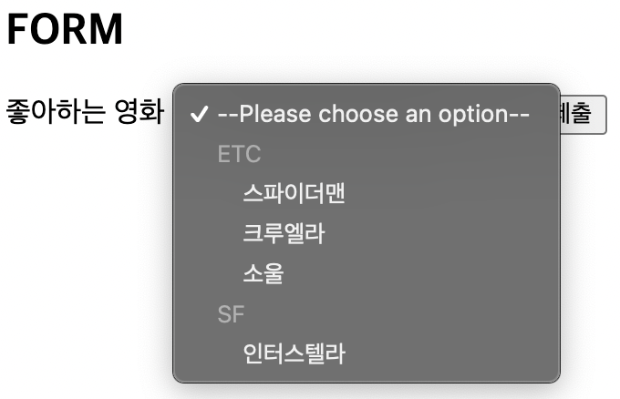
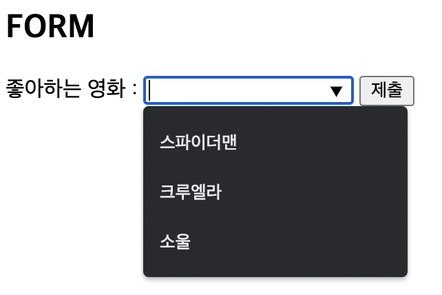

# 1. 폼 관련 요소 📝
## 1.1. form
`<form>`
 * 정보를 제출하기 위한 대화형 컨트롤을 포함하는 문서 구획
 * `action`
   - 양식 데이터를 처리할 프로그램의 URI
   - 데이터를 보낼 목적지의 주소를 입력받음
 * `method`
   - 양식을 제출할 때 사용할 HTTP 메서드
     + `post` : POST 메서드. 양식 데이터를 요청 본문으로 전송
     + `get` : GET 메서드. 양식 데이터를 action **URL**과 **?** 구분자 뒤에 이어 붙여서 전송 ➡️ 주소창에 드러나므로 **보안에 약함**
     + dialog : 양식이 \<dialog> 안에 위치한 경우, 제출과 함께 대화 상자를 닫음

## 1.2. label과 input
`<label>`
 * 사용자 인터페이스 항목의 설명을 나타냄
 * 가능하면 접근성 측면에서 `<input>`을 설명하는 문구를 정확하게 텍스트로 적어주는 것이 좋음
 * `for`
   - 레이블 가능한 요소일 때, **for 속성값과 일치하는 <i>id</i>를 가진 문서의 첫 번째 요소**는 그 label 요소의 라벨 제어라고 함
   - `<label>`의 형제가 아닌 **자식**으로 `<input>`를 갖는다면 for과 id 속성을 각각 입력할 필요가 없음


## 1.3. fieldset, legend
`<fieldset>`
 * 여러 컨트롤과 레이블(\<label>)을 묶을 때 사용
 * display 속성 - **block**
 * `disabled`
   - 모든 자식 컨트롤을 비활성화
  
`<legend>`
 - 부모인 \<fieldset>의 콘텐츠 설명을 나타냄
 - <b>\<fieldset></b>의 **첫 번째 자식**이어야 함

예시)
```html
<form action="" method="GET">
  <fieldset disabled>
    <legend>범례 1</legend>
    <div>
      <label for="foodname">음식 이름 : </label>
      <input type="text" name="food" id="foodname">
    </div>
    <div>
      <label for="color">색깔 : </label>
      <input type="text" name="color" id="color">
    </div>
  </fieldset>
  <button type="submit">제출</button>
</form>
```

## 1.4. input
`<input>` (입력 요소)
 - 사용자의 데이터를 받을 수 있는 대화형 컨트롤을 생성
 - **빈 요소**이기 때문에 닫는 태그가 없음

`type`
 - [적용 코드](../../code/ex_2.html)

`name`
 - \<input> form의 이름
 - 이름/값 짝(name/value pair)의 일부로서 form과 함께 전송됨

`placeholder`
 - \<input> form이 비어있을 때 form에 나타나는 내용

`autocomplete`
 - form 자동완성 기능을 암시
 - **on/off**로 사용을 지정함

`required`
 - Boolean 속성
 - 필수 form을 지정할 때 사용

`disabled`
 - 입력도 불가능하고 form 데이터도 전송되지 않음
  
`readonly`
 - 단순히 수정만 불가능하고 form 데이터는 전송됨
 - `value`로 기본값 설정 가능

`min`, `max`, `step`
 - \<input type="`number`"/>와 \<input type="`range`"/>에서 설정할 수 있음

## 1.5. button
`<button>`
 * 클릭 가능한 버튼을 나타냄
 * **빈 요소 X**, 닫는 태그 O
 * 아이콘만으로 기능을 표현하는 버튼은 접근성이 떨어짐
 * `type`
   - **submit** : 버튼이 서버로 form 데이터를 제출함
   - **reset**
   - **button** : 기본 행동이 없으며 클릭했을 때 아무것도 하지 않음
  
#### 💡 `<input>`와 다른 점
 > `<input>` : 빈 요소, `<button>` : 자식을 가질 수 있는 요소<br>
 > `<button>`는 자식을 가질 수 있기 때문에 단순히 문자열로 버튼을 꾸밀 수 있는 것이 아니라,<br>
 > 내부에 이미지나 svg 등을 추가해서 넣을 수 있음. ➡️ 스타일링을 용이하게 할 수 있음.

예시)
```html
<form action="" method="GET">
  <div>
    <input type="reset" />
    <input type="submit" />
    <input type="button" value="빈 버튼" />
  </div>
  <div>
    <button type="reset">
      <em>초기화</em>
    </button>
    <button type="submit">제출</button>
    <button type="button">일반 버튼</button>
  </div>
</form>
```

## 1.6. select, option, optgroup
`<select>`
 - 옵션 메뉴를 제공하는 컨트롤을 나타냄
 - 사용자가 **수정 불가능**
 - **자식** 요소 : `<option>`, `<optgroup>`

예시)
```html
<form action="" method="GET">
  <label for="movie">좋아하는 영화 : </label>
  <select id="movie" name="movie" required>
    <!-- 후보군 -->
    <option value="">--Please choose an option--</option>
    <optgroup label="ETC">
      <option value="Spider-Man">스파이더맨</option>
      <option value="Cruella">크루엘라</option>
      <option value="Soul">소울</option>
    </optgroup>
    <optgroup label="SF">
      <option value="Interstellar">인터스텔라</option>
    </optgroup>
  </select>
  <input type="submit" />
</form>
```




## 1.7. input - list 속성과 datalist
`list`
 - \<datalist>의 **id**를 가리킴
 
`<datalist>`
 - 다른 컨트롤에서 고를 수 있는 가능한 선택지를 추천하는 \<option> 여럿을 담음
 - 사용자가 **수정 가능**

예시)
```html
<form action="" method="GET">
  <label for="movie">좋아하는 영화 : </label>
  <input type="text" id="movie" name="movie" list="movie-list"/>
  <datalist id="movie-list">
    <!-- 후보군 -->
    <option>스파이더맨</option>
    <option>크루엘라</option>
    <option>소울</option>
  </datalist>
  <input type="submit" />
</form>
```



## 1.8. textarea
 - \<input type="text">와 비슷함
 - **멀티라인** 일반 텍스트 편집 컨트롤
 - **빈 요소 X**, 닫는 태그 O
 - `rows="숫자"`, `cols="숫자"`, `disabled`, `readonly`, `placeholder`, `required`, ...


# 2. 전역 속성 🌐
## 2.1. `class`
 * 공백으로 구분한 요소 클래스의 목록
 * 대소문자 구분 ❌
 * 메서드를 통해 요소에 접근할 수 있는 방법
 * 하나의 요소는 여러 개의 class를 가질 수 있음

## 2.2. `id`
 * 문서 전체에서 **유일한 고유식별자**(ID)를 정의함
 * 공백 ❌
 * 하나의 요소는 하나의 id만 가질 수 있음
 * 영어로 시작해야 함
 * 고유식별자의 목적
   - 프래그먼트 식별자를 사용해 요소를 가리킬 때와 스크립트 및 스타일 적용 시 특정 요소를 식별하기 위함
 
## 2.3. `style`
 - 요소에 적용할 CSS 스타일 선언을 담음
 - 스타일은 별도의 파일에 정의하는 것이 권장됨

## 2.4. `title`
 - 요소와 관련된 추가 정보를 제공하는 텍스트를 나타냄
 - 여러 줄을 가질 수 있음
 - title 안에서 줄을 바꿀 땐 조심해야 함
 - 요소가 title 특성을 가지고 있지 않을 땐 부모 요소로부터 상속함

## 2.5. `lang`
 - 요소 내의 수정 불가한 텍스트의 언어와, 수정 가능한 텍스트가 사용해야 하는 언어를 정의함

## 2.6. `data`
 - `data-*` 속성은 HTML5 특정 요소와 연관되어 있지만, 확정된 의미는 갖지 않는 데이터에 대한 확장 가능성을 염두에 두고 디자인됨
 - JavaScript나 CSS에서 접근하기 위한 용도로 쓰임

## 2.7. `draggable`
 - 요소의 드래그 가능 여부를 나타내는 열거형 특성
 - `draggable="true"` (요소를 드래그 할 수 ⭕️)
 - `draggable="false"` (요소를 드래그 할 수 ❌)
 - JavaScript에서 이벤트에 따른 효과를 정의할 수 있음

## 2.8. `hidden`
 - Boolean 속성
 - 해당 요소가 아직, 또는 더 이상 관련이 없음을 나타냄
 - 브라우저는 이 속성을 설정한 요소를 렌더링 하지 않음
 - 보안상으로는 좋지 않음
 - CSS `display` 속성 값을 지정한 요소는 hidden 속성이 존재하더라도 화면에 보이게 됨