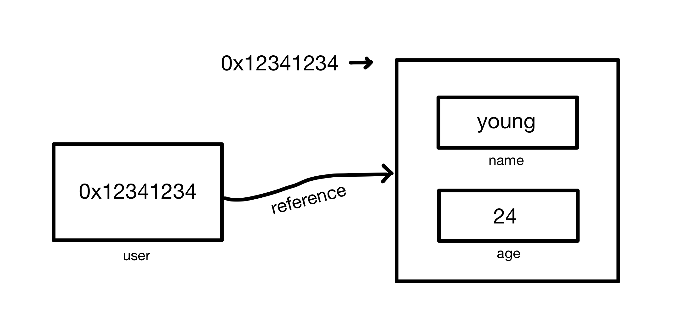

# 1. 자료형
 - 목적에 따라 특별한 성질이나 정해진 범주를 갖고 있는 데이터의 종류
 - 6가지 원시 타입 + 1가지 객체 타입
 - **원시 타입** (primitive type)
   - Boolean
     - 논리적 값으로 true, false
   - null
     - 존재하지 않거나 유효하지 않은 주소 표시
   - undefined
     - 선언 후 값을 할당하지 않은 변수
   - number
     - 정수, 실수 등의 숫자, 정수의 한계는 ±2⁵³
   - string
     - 빈 문자열이나 글자들을 표현하는 문자열
   - symbol
     - 문자열과 함께 객체 property로 사용, ES6에 추가
 - **객체 타입** (object type)
   - object
     - 두 개 이상의 복잡한 개체 저장 가능

## 1.1. 원시 타입
### `typeof`
 - 인수의 자료형을 반환하는 연산자
 - 연산자인 `typeof x`와 함수인 `typeof(x)`로 문법 지원

```js
console.log(typeof undefined); // output: undefined
console.log(typeof 123); // output: number
console.log(typeof 456n); // output: bigint
console.log(typeof 123.45); // output: number
console.log(typeof true); // output: boolean
console.log(typeof "hello"); // output: string
console.log(typeof Symbol("id")); // output: symbol
console.log(typeof Math); // output: object
console.log(typeof null); // output: object
console.log(typeof console.log); // output: function
```

### `boolean`
 - 논리적인 값을 표현하는 자료형
 - 참인 `true`와 거짓인 `false` 두 가지 값만 존재
 - 주로 조건문 등에서 동작 판단의 기준으로 사용

```js
let name_check = true; // 네, name 입력이 확인되었습니다.
let age_check = false; // 아니요, age 입력이 확인되지 않았습니다.
let value_check = 10 > 5; // 비교 결과: 참 -> true
console.log(value_check); // output: true
```

### `null`
 - 값이 비어 있다는 의미로 표현되는 자료형
 - 존재하지 않는(nothing), 비어 있는(empty), 알 수 없는(unknown) 값을 나타낼 때 사용

```js
console.log(typeof null); // output: object <- 하위 버전 호환성으로 object 표기

const null_check = 123;
console.log(null_check === null); // output: false
```

### `undefined`
 - 값이 할당되어 있지 않은 상태를 나타낼 때 사용되는 자료형
 - 변수 선언 후 초기화 하지 않는다면 undefined가 자동으로 할당

```js
let name; // 할당 후 초기화하지 않음
console.log(name) // output: undefined
```

### `number` (숫자형)
 - 정수, 부동소수점(floating point) 숫자를 표현하는 자료형
 - 관련된 연산은 사칙연산(+, -, *, /)가 대표적
 - 일반적인 숫자 외에 Infinity, -Infinity, NaN(Not a Number) 같은 특수 숫자 값이 포함
 - 2⁵³ - 1 보다 큰 값을 사용할 수 X ➡️ 더 큰 정수를 다루고 싶으면 bigint 자료형 사용 필요

```js
let num_1 = 123.0;
let num_2 = 123.456;
console.log(num_1 - num_2); // output: -0.45600000000000307 -> 부동소수점 연산이 완벽하지 않음
console.log((num_1 - num_2).toFixed(3)); // output: -0.456
console.log(num_1 / "hello"); // NaN

let num_3 = -1 / 0;
console.log(num_3); // -Infinity

let num_4 = 123456n; // BigInt("123456")
console.log(typeof num_4); // bigint
```

### `string`
 - 문자, 문자열을 표현하는 자료형
 - 3가지 종류의 따옴표로 표현 가능
   - 큰 따옴표: "hello"
   - 작은 따옴표: 'hello'
   - 역 따옴표(백틱, backtick): \`hello`
 
```js
let str_1 = "hi_1";
let str_2 = 'hi_2';
let num = 5;
let str_3 = `hi_${num}`;

console.log(str_1) // output: hi_1
console.log(str_2) // output: hi_2
console.log(str_3) // output: hi_5
```


## 1.2. 객체 타입
### `object`
 - 다수의 원시 자료형을 포함하거나 복잡한 개체(entity)를 표현할 수 있는 자료형
 - Object() 혹은 중괄호({})를 통해 생성
 - object의 **개체**는 `key: value` 형태로 표현, **접근**은 `object.key` 형태로 표현

```js
let user = {
  name: "young",
  age: 24,
};
```

<br>

#### 객체 예제 코드
1. <br>

   ```js
   let user = {
     name: "young", // key: "name", value: "young"
     age: 24, // key: age, value: 24
   };

   console.log(typeof user); // output: object
   console.log(typeof user.name); // output:  string
   console.log(typeof user.age); // output: number
 
   console.log(user.name); // output: young
   console.log(user.age); // output: 24
 
   user.age = 23;
   console.log(user.age); // output: 23
   ```


2. <br>

   객체(object)에 개체(entity) **추가** ➡️ `obj.key = value` / **삭제** ➡️ `delete` 명령어를 통해 수행
   <br>

   ```js
   let user = {
     name: "young",
     age: 24,
   };

   console.log(user); // output: { name: 'young', age: 24 }
   
   user.mbti = "ESFJ"; // or user["mbti"] = "ESFJ";
   console.log(user); // output: { name: 'young', age: 24, mbti: 'ESFJ' }

   delete user.age; // output: { name: 'young', age: 24 }
   console.log(user); // output: { name: 'young', mbti: 'ESFJ' }
   ```
  
   객체 복사 **문제점**
   ```js
   let user = {
     name: "young",
     age: 24,
   };

   let admin = user;
   admin.name = "kjy";

   console.log(admin.name); // output: kjy
   console.log(user.name); // output: kjy

   user.age = 20;
   console.log(user.age); // output: 20
   console.log(admin.age); // output: 20
   ```


### object 복사
 - object의 값을 복사할 때는 대상 전체가 아닌 **object 내 주소 값만 복사되는 문제** 발생
 - 가리키는 대상 전체를 복사하는 방법은 `얕은 복사`(Shallow copy), `깊은 복사`(Deep copy)를 통해 가능

#### 1. 얕은 복사 (Shallow copy)
##### ① 반복문 `for문` 을 통한 객체 복사

  ```js
  let user = {
  name: "young",
  age: 24,
  };

  let admin = {};
  for (let key in user) {
    admin[key] = user[key];
  }

  admin.name = "kjy";
  user.age = "20";

  console.log(user.name); // output: young
  console.log(admin.name); // output: kjy
  console.log(user.age); // output: 20
  console.log(admin.age); // output: 24
  ```
 
##### ② `Object.assign()` 함수를 이용한 객체 복사

  ```js
  let user = {
    name: "young",
    age: 24,
  };

  let admin_obj = Object.assign({}, user);

  admin_obj.name = "kjy";
  user.age = "20";

  console.log(user.name); // output: young
  console.log(admin_obj.name); // output: kjy
  console.log(user.age); // output: 20
  console.log(admin_obj.age); // output: 24
  ```
 
##### ③ ES6에서부터 지원하는 `전개 연산자(Spread Operator)` 를 이용한 객체 복사

  ```js
  let user = {
    name: "young",
    age: 24,
  };

  let admin_spread = { ...user }; // { user.name, user.age }

  admin_spread.name = "kjy";
  user.age = "20";

  console.log(user.name); // output: young
  console.log(admin_spread.name); // output: kjy
  console.log(user.age); // output: 20
  console.log(admin_spread.age); // output: 24
  ```

#### 얕은 복사 (Shallow copy) 문제점
 - 객체 내 또 다른 객체가 있다면 복사되지 않음

    ```js
    let user = {
      name: "young",
      age: 24, 
      types: {
        blood: "AB",
        mbti: "ESFJ",
      },
    };

    let admin_obj = Object.assign({}, user);

    admin_obj.types.blood = "A";
    admin_obj.types.mbti = "INFP";

    console.log(admin_obj.types.blood); // output: A
    console.log(admin_obj.types.mbti); // output: INFP
    console.log(user.types.blood); // output: A
    console.log(user.types.mbti); // output: INFP
    ```

#### 2. 깊은 복사 (Deep copy)
##### ① `재귀 함수` 를 이용한 객체 복사

  ```js
  let user = {
    name: "young",
    age: 24, 
    types: {
      blood: "AB",
      mbti: "ESFJ",
    },
  };

  function copyObj(obj) {
    let result = {};
    for (let key in obj) {
      if (typeof obj[key] === "object") result[key] = copyObj(obj[key]);
      else result[key] = obj[key];
    }
    return result;
  }

  let admin = copyObj(user);

  admin.types.blood = "A";
  admin.types.mbti = "INFP";

  console.log(admin.types.blood); // output: A
  console.log(admin.types.mbti); // output: INFP
  console.log(user.types.blood); // output: AB
  console.log(user.types.mbti); // output: ESFJ
  ```

##### ② `JSON 객체` 를 이용한 객체 복사
 - stringify는 객체를 문자열로 반환하는데 이때 원본 객체와의 참조가 끊김

  ```js
  let user = {
    name: "young",
    age: 24, 
    types: {
      blood: "AB",
      mbti: "ESFJ",
    },
  };

  // stringify: js object -> string
  // parse: string -> js object
  let admin_json = JSON.parse(JSON.stringify(user));

  admin_json.types.blood = "A";
  admin_json.types.mbti = "INFP";

  console.log(admin_json.types.blood); // output: A
  console.log(admin_json.types.mbti); // output: INFP
  console.log(user.types.blood); // output: AB
  console.log(user.types.mbti); // output: ESFJ
  ```