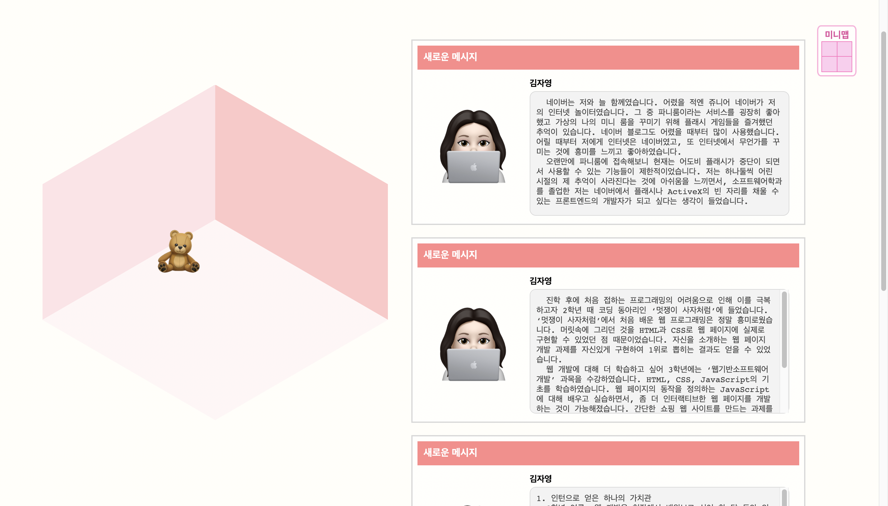

1) [list](../../code/ex_1.html)
2) [form](../../code/ex_2.html)
3) [animation](../../code/animation.html)
4) [flex](../../code/flex.html)
5) [grid](../../code/grid.html)
6) [종합적 구현1](../../code/essay.html)
   - 프론트엔드 개발자로 일하고 싶은 기업과 그 이유에 대한 것들을 HTML과 CSS로 파니룸을 만들어 메시지 창에 적어놓음.
   - 미리보기
     - 